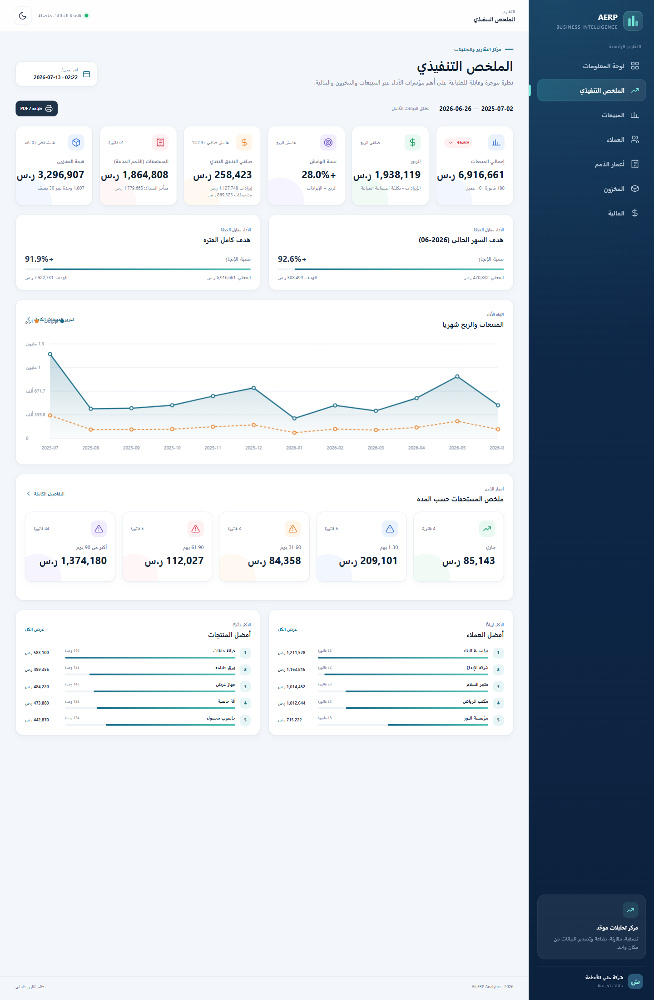
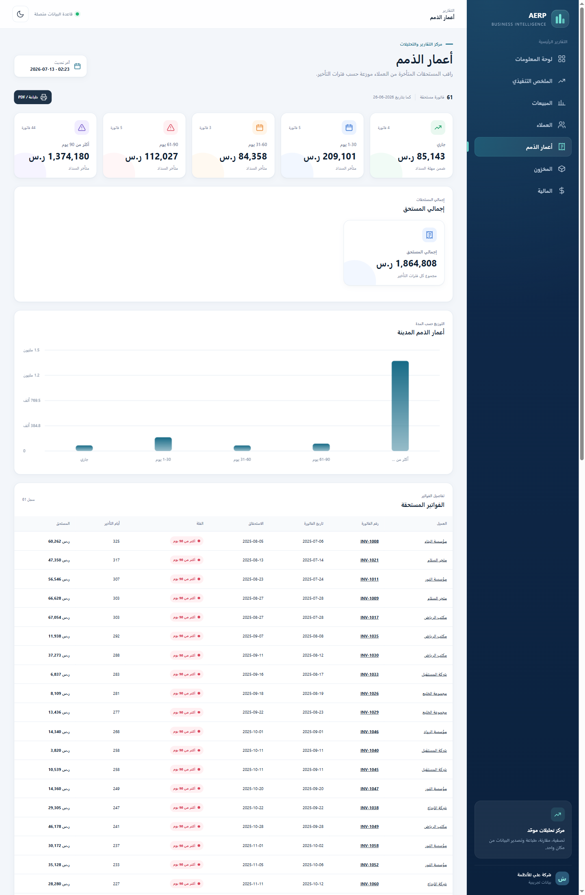
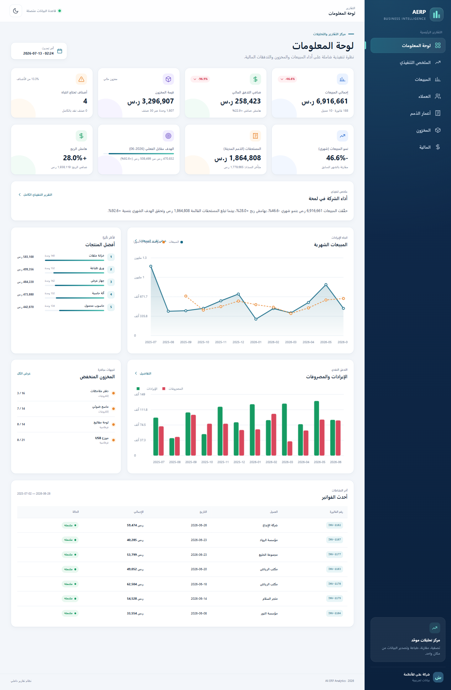
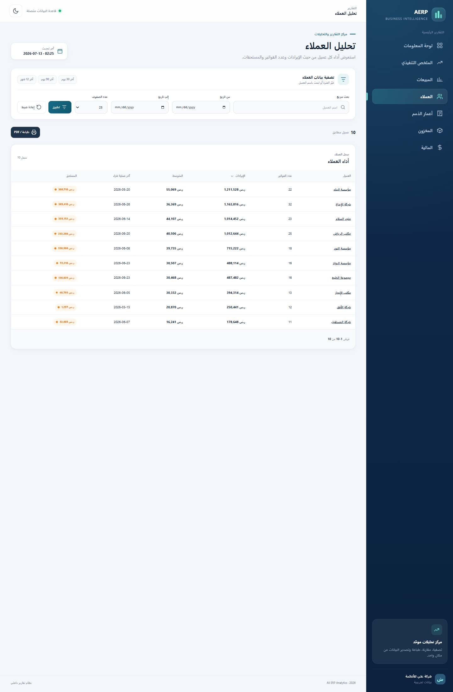
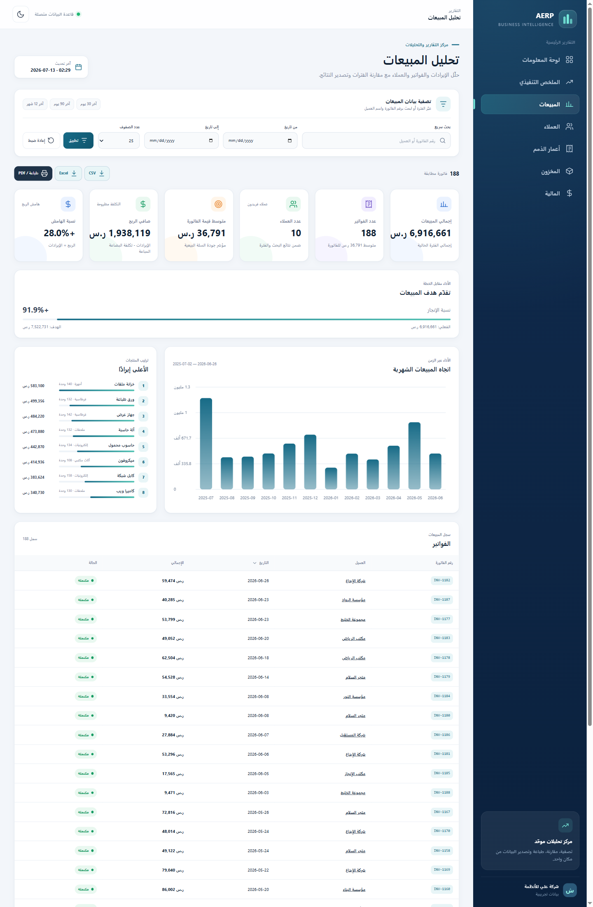
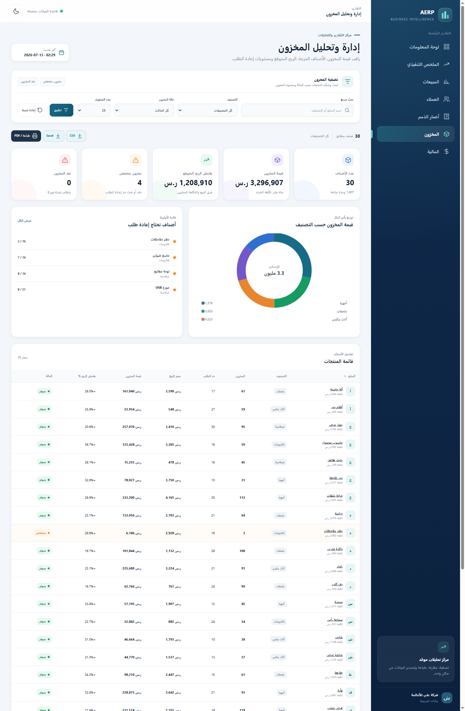
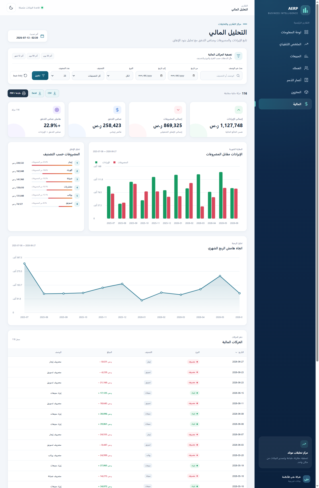

# تقرير ترقية التقارير الاحترافية — Ali ERP Analytics

> توثيق ترقية النظام إلى تقارير احترافية تعتمد عليها الإدارة.
> التاريخ: 2026-07-13 · الأساس: v2.0 (`51d82bf`)

## 1. نظرة عامة

رُقّي النظام بأربع حزم رئيسية تجعل التقارير جاهزة لاتخاذ القرار: **تحليلات أعمق + أهداف**، **التعمق (Drill-down)**، **تقارير ERP إضافية**، و**طباعة/PDF بهوية الشركة** — مع الحفاظ على معمارية MVC النظيفة وأسلوب الكود القائم.

**رابط المستودع:** https://github.com/alimossaed38/erp-report-generator

## 2. ما الجديد

### أ) تحليلات أعمق + أهداف
- **طبقة تحليلات** جديدة (`app/Core/Analytics.php`): نمو شهري/سنوي (MoM/YoY)، متوسط متحرك ٣ أشهر، دلاء أعمار الذمم، ونسبة إنجاز الأهداف.
- **أساس بيانات موسّع:** أعمدة سداد الفواتير (`due_date`, `amount_paid`) وجدول أهداف شهرية (`targets`) — ببذور حتمية.
- **لوحة المعلومات:** بطاقات نمو المبيعات، **المستحقات (AR)** مع المتأخر، **الهدف مقابل الفعلي** (شريط تقدّم)، **هامش الربح**، ومتوسط متحرك على منحنى المبيعات، وشريط ملخص تنفيذي.
- **المبيعات:** مؤشرات الربح والهامش، تقدّم الهدف، ونمو الفترة.
- **المخزون:** هامش ربح لكل صنف + هامش متوقع إجمالي.
- **المالية:** اتجاه هامش الربح الشهري.

### ب) التعمق (Drill-down)
- **`/customers`** تقرير العملاء (إيراد، فواتير، متوسط، آخر شراء، رصيد مستحق) — بحث/ترتيب/صفحات.
- **`/customers/view`** تفاصيل العميل: مؤشرات + اتجاه شهري + كل فواتيره (مرتبطة بتفاصيل الفاتورة).
- **`/products/view`** تفاصيل المنتج: الحالة، تاريخ المبيعات، الهامش، الفواتير المتضمّنة.
- **`/invoices/view`** تفاصيل الفاتورة: الترويسة + حالة السداد + البنود + الإجماليات.
- الروابط متسلسلة: العملاء ← عميل ← فاتورة، والمنتجات ← منتج ← فاتورة.

### ج) تقارير ERP إضافية
- **`/aging`** أعمار الذمم المدينة: دلاء (جاري/1-30/31-60/61-90/+90) + رسم + جدول الفواتير المستحقة مرتبة بأيام التأخير.
- **`/summary`** الملخص التنفيذي: نظرة صفحة واحدة عبر كل المجالات — الهدف الأساسي للطباعة.

### د) طباعة/PDF بهوية
- ترويسة رسمية (شعار + اسم الشركة + الشعار النصي + عنوان التقرير + تاريخ الإصدار) وتذييل "مستند داخلي — سري"، تظهر عند الطباعة فقط.
- `@page A4` بهوامش، إخفاء عناصر التنقّل/الأزرار، جداول لا تنكسر صفوفها وتكرار ترويسة الجدول، ووضع طباعة نظيف حتى في الثيم الداكن.
- إعدادات الهوية في `config/app.php` (`company_logo`, `company_tagline`, `report_footer`, `net_terms_days`).

## 3. نتائج الاختبار

### 3.1 اختبارات الوحدة (حتمية)
`"C:/wamp64/bin/php/php8.3.28/php.exe" tests/run_unit.php` → **10/10 مجموعات ناجحة** (`TESTS COMPLETED`, exit 0):
`analytics_test` (نمو/متوسط متحرك/أعمار/أهداف مع اختبار انحدار لثغرة YoY)، `targets_test`، `customers_test`، `aging_test`، `sales_repo_test`، `inventory_repo_test`، `finance_repo_test`، `export_test`، `seed_test`، `router_test`.

### 3.2 اختبار الواجهات (UI Automation — Playwright، قاده Claude)
- الصفحات العشر كلها تُرجع 200 و **console خالٍ من الأخطاء**؛ الرسوم المحلية تُرسم كاملة.
- **بحث/ترتيب/صفحات المبيعات:** `q=الأفق`→22 نتيجة؛ ترتيب بالإجمالي تنازلياً؛ الصفحة 2 متصلة.
- **الفلاتر:** المخزون `status=low`→4؛ المالية `type=expense`→67.
- **التعمق:** العميل «مؤسسة البناء» ← 22 فاتورة، مستحق 300,710 (مطابق لصف القائمة)، وكل فاتورة مرتبطة بتفاصيلها.
- **أعمار الذمم:** مجموع الدلاء = إجمالي المستحق (1,864,808؛ فرق تقريب عرضي 1 ر.س)، 61 فاتورة مرتبة بأيام التأخير (أعلى 325 يوماً).
- **الأهداف:** أشرطة التقدّم تعرض الفعلي/الهدف والنسبة (لوحة المعلومات + الملخص).
- **الطباعة:** ترويسة الهوية موجودة ومخفية على الشاشة، تظهر عند الطباعة.

## 4. لقطات الواجهات

### الملخص التنفيذي (هدف الطباعة)


### أعمار الذمم المدينة


### لوحة المعلومات (المحدّثة)


### تقرير العملاء


### المبيعات · المخزون · المالية (المحدّثة)




## 5. الجودة وسير العمل

- نُفّذت الترقية على **٨ مراحل** (A–H) + تحقق (I)، كل مرحلة: TDD → مراجعة (spec + جودة) على نموذجين مستقلين → إصلاح الملاحظات → commit + push.
- أُصلحت ملاحظات مراجعة حقيقية أثناء العمل: ثغرة YoY عند فجوة البيانات، استعلامات مكرّرة في لوحة المعلومات والملخص، ودعم الوضع الداكن عند الطباعة.
- SQL مُعامَل بالكامل، ومخرجات مهرّبة (`Ui::e`)، وحالات فارغة ودّية بدل أخطاء 500.

## 6. سجل الرفع (أول بأول)

```
9143b99 feat(print): branded print/PDF header, footer, @page layout
4a59733 perf(summary): derive growth/current-month from monthlyMargin (dedupe query)
3a15bb3 feat(summary): executive summary report
5a94400 feat(aging): AR aging report with buckets
ec3a0cc feat(drilldown): customers report + customer/product/invoice detail pages
5589c4d feat(inventory,finance): product margin + links + profit-margin trend
70b6c52 fix(dashboard): dedupe monthly() query + consistent JSON_HEX flags
6023933 feat(sales,dashboard): margin, growth, targets, AR, moving average
63c2565 fix(analytics): YoY null on data gap
e050392 feat(analytics): growth/moving-average/aging/targets + sales margin & AR
57fbdbc feat(data): invoice payments + due dates + monthly targets
5d067cd docs: implementation plan · d3be734 docs: design spec
```

## 7. ملاحظات وتحسينات مستقبلية (اختيارية)
- ترقيم صفحات الطباعة تذييل ثابت متكرر (بديل عملي لعدّادات CSS paged-media).
- `Ui::percent` تضيف إشارة `+` للنسب المطلقة (هوامش) كما للفروقات — يمكن توحيدها لاحقاً.
- ترويسة الطباعة تعرض العنوان والتاريخ لكن لا تُبرز نطاق الفلتر المطبّق (تحسين اختياري).
